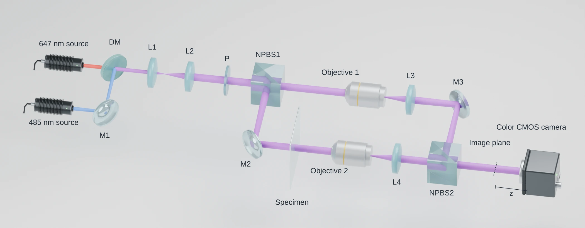
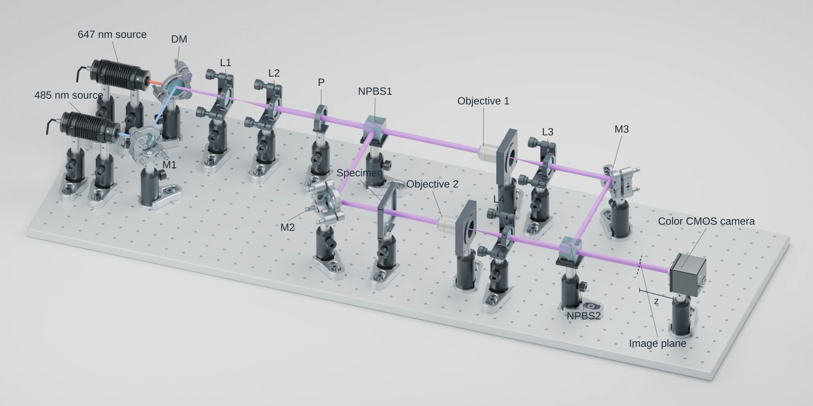
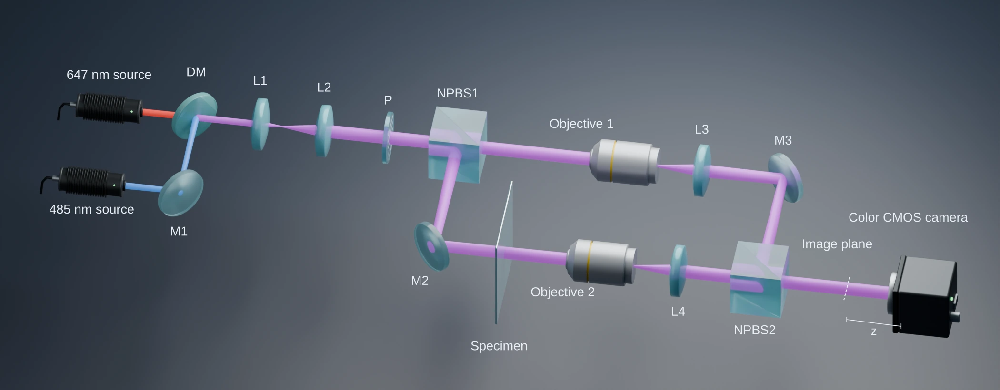
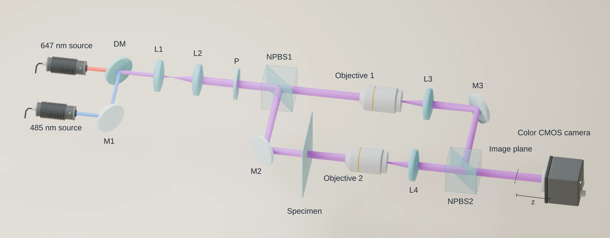
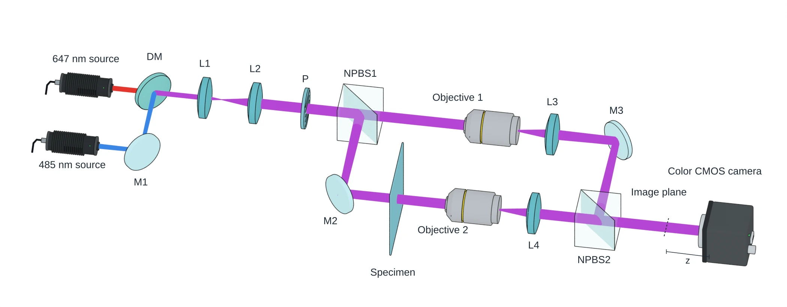
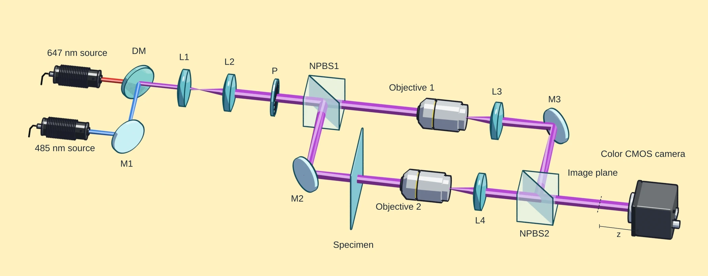
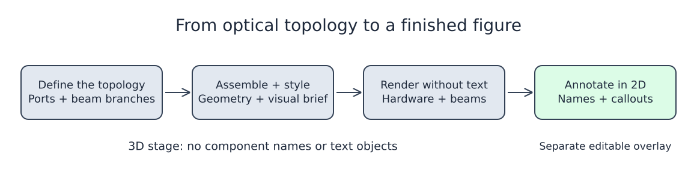

# Blender Optical Path

一个在 Blender 里画光路图的 agent skill。描述好光路布局后，agent 会建立光束模型，摆放并对齐元件，渲染场景，再在单独的 2D 图层里加标注。最终得到可编辑的 `.blend`、不带文字的渲染图和带标注的 SVG。

常见用途：成像与显微光路、干涉仪、光刻装置。

[English](README.md)



示例是一套双波长装置，用了元件库里的 17 个元件。647 nm 和 485 nm 两路光在二向色镜处合束，分进两条物镜臂，再在相机前重新合束。

[复现示例](examples/README.md) · [可编辑标注 SVG](docs/examples/floating-matte.svg) · [装配脚本](examples/dual_wavelength_interferometer.py)

## 两种视图

默认是浮动光学：只画光学元件本身，元件放大、间距缩短，图更紧凑。机械装配画出完整的支架和底座，保持 CAD 原始尺寸。

| 浮动光学 | 机械装配 |
| --- | --- |
|  |  |

[可编辑机械视图 SVG](docs/examples/mechanical-matte.svg)

## 五种着色风格

布局和相机相同，材质与光照不同。紫色表示合束后的光。

| 风格 | 预览 |
| --- | --- |
| **Matte Technical**：哑光金属，玻璃清晰可辨 |  |
| **Soft Lab**：暗色背景，光束柔和发亮 |  |
| **Illustrated Geometry**：暖色柔和阴影，青色半透明分光镜 |  |
| **Textbook White**：白底，细黑边 |  |
| **Cel / Toon**：色阶分层，青色和灰色轮廓线 |  |

配方与提示词：[着色预设](references/shading-presets.md) · [紧凑构图](references/compact-floating-prompt.md) · [视觉风格](references/visual-style.md)

## 工作流程



1. **理解需求**：读懂请求，理清拓扑和光束路径。
2. **一次澄清**：把待定问题集中在一轮里问完。
3. **光路建模**：计算共轭面和光束包络。
4. **装配**：从随附的元件库里摆放并对齐元件。
5. **风格与预览**：选定着色风格，先看小图预览。
6. **校验与交付**：检查结果，导出文件。

[可编辑流程图](docs/workflow.excalidraw)（可在 [Excalidraw](https://excalidraw.com) 中打开）

## 安装

需要 Blender 5.2 或更高版本，已在 5.2.2 LTS 上测试。pi 用户：

```bash
git clone https://github.com/lychen2/blender-optical-path.git \
  ~/.pi/agent/skills/blender-optical-path
```

执行 `/reload`，再用 `/skill:blender-optical-path` 调用。其他 agent 把整个文件夹复制到对应的 skill 目录，并加载 [`SKILL.md`](SKILL.md)。

示例请求：

> 画一个可编辑的迈克尔逊干涉仪。用简化的 3D 示意风格、高角度斜视相机、粗的彩色光束、白色背景和哑光支架。渲染时不带文字，之后在单独的 2D 图层里加上 BS、M1、M2 和 Detector。

请写明拓扑、已知尺寸和目标成图尺寸。

## 默认设置

- 标注放在单独的 2D 图层，3D 渲染图里只有几何体，改标注不用重新渲染。
- 光束画成粗的彩色实体，需要细线时在请求里说明。

## Python 与 MCP

在 Blender 里：

```python
import runpy
api = runpy.run_path('/path/to/blender-optical-path/tools/optics.py')
scene = api['new_workspace']('Optical diagram')
api['place_asset']('assembly/biconvex_lens', (0, 0, 100),
                   scene=scene, at_optical_center=True)
api['add_beam']([(-100, 0, 100), (100, 0, 100)], scene=scene)
```

坐标单位为毫米。想在命令行里试一个最小场景，传入一个新的输出目录：

```bash
blender -b --factory-startup --python-exit-code 1 \
  --python tools/example_scene.py -- --output /chosen/new-example
```

运行后，该目录里会生成 `.blend`、PNG 预览和一份简短报告。

连接 Blender MCP 服务器后，`tools/blender_mcp_entry.py` 可以通过 JSON 请求调用同一套 API。详见 [API 与 MCP 参考](references/python-mcp.md)。

## 元件库

`library/Optical_Components.blend` 收录 70 个元件：24 个带支架的装配体、18 个厂商 CAD 零件、28 个示意模块。可以直接打开浏览，也可以通过 API 按 id 放置。元件 id 和来源记录在 `library/index.json` 与 `library/provenance/` 中。

- [手动装配](references/manual.md)
- [支持的光路系统](references/system-coverage.md)
- [从官方 CAD 添加零件](references/thorlabs-workflow.md)

## 自检

```bash
blender -b --factory-startup --python-exit-code 1 \
  --python tools/check_package.py
```

`tools/validate_layout.py` 用于检查已保存的布局。

## 许可

代码和文档采用 [MIT 许可证](LICENSE)。厂商 CAD 沿用其原有条款，见[第三方声明](THIRD_PARTY_NOTICES.md)。
